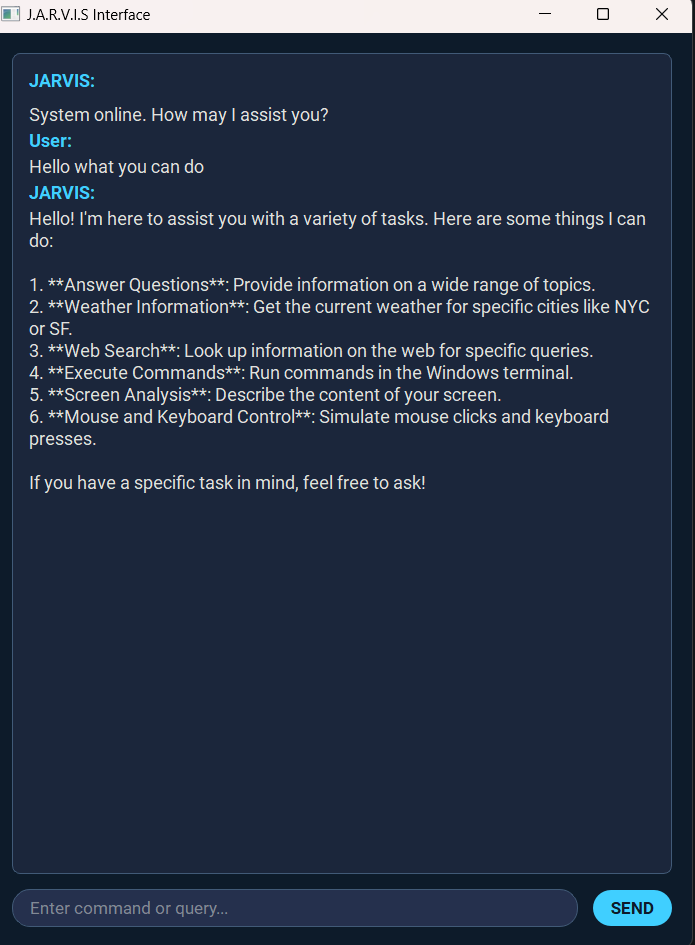

# Vector - Advanced AI Assistant

Vector is an AI assistant built using LangGraph and PyQt5 that can perform a variety of tasks through natural language commands, including web searches, file operations through terminal commands, reading the screen, and interacting with UI elements.

## Features

- **Natural Language Interface**: Interact with your computer using conversational language
- **Screen Reading**: Analyze and describe the content currently visible on your screen.
- **UI Automation**: Click buttons, type text, and press keys based on screen content or coordinates.
- **Terminal Command Execution**: Execute Windows terminal commands for file and system operations
- **Web Search**: Search the web for up-to-date information
- **Conversation Memory**: Vector remembers context from previous interactions
- **Futuristic UI**: Modern, dark-themed interface

## Requirements

- Python 3.8+
- OpenAI API key
- Tavily API key (for web search)

## Installation

1. Clone this repository
2. Install the required packages:
   ```
   pip install -r requirements.txt
   ```
3. Set up your API keys in the `.env` file:
   ```
   OPENAI_API_KEY=your_openai_api_key
   TAVILY_API_KEY=your_tavily_api_key
   ```

## Usage

### GUI Version (Recommended)

Run Vector with the modern GUI interface:

```
python vector_ui.py
```

The GUI provides:

- Chat interface for interacting with Vector
- Popup confirmations for sensitive operations
- Status indicator showing when Vector is processing a request

### Command Line Version

Not currently available. `vector.py`'s `__main__` block is commented out, so running `python vector.py` directly just imports the module and exits without starting an interactive session. The GUI (`python vector_ui.py`) is the only working entry point right now.

### Example Commands

You can ask Vector to:

1. **Run Terminal Commands**:

   - "List the files in the current directory"
   - "Read the content of file.txt"
   - "Create a new folder called 'projects'"
   - "Delete the file named 'temp.txt'"

2. **Search the Web**:

   - "Search for the latest news about artificial intelligence"
   - "Find information about Python programming"

3. **General Questions**:

   - "What is the capital of France?"
   - "How do I create a Python virtual environment?"

4. **Screen Interaction (Requires careful use and potentially specific coordinates from screen description):**
   - "Describe my screen" (or "Read the screen")
   - "Click the button near the center" (Agent needs coordinates from description)
   - "Click at coordinates 500, 300"
   - "Type 'hello world' into the selected field" (Make sure field is selected first)
   - "Press the enter key"

### Security Features

Before running a terminal command, Vector checks it against a keyword heuristic for destructive operations (`del`, `erase`, `rmdir`, `format`, `taskkill`, `shutdown`, output redirection, etc. — see `is_destructive_command` in `tools/open_terminal.py`). If the command matches, Vector asks for confirmation before proceeding: a popup dialog (Yes/No) in the GUI. A `y/N` console prompt also exists in the code as a fallback (`_default_confirmation_handler` in `tools/open_terminal.py`) for when no GUI handler is registered, but since the CLI entry point is currently disabled, the GUI popup is the only path exercised in practice.

This is a keyword heuristic, not a sandbox. A command that deletes or overwrites data without matching one of the known patterns will run without a prompt. Treat this as a guard against obviously destructive commands, not a full safety boundary — commands that aren't flagged still execute immediately and unconfirmed.

## UI Overview

The Vector UI is a single chat panel:

- Type your questions or commands in the input box
- View the conversation history in the chat area
- Vector's reply is rendered as one message once the agent finishes processing (it is not streamed in token-by-token); the input box is disabled and its placeholder reads "VECTOR is processing..." while a request is in flight



> Note: this screenshot is out of date — it shows an old window title ("J.A.R.V.I.S Interface") from before the app was renamed to Vector. The single-panel layout it depicts is still accurate.

## Extending Vector

You can extend Vector by adding more tools in the `tools` directory (like `screen_reader.py` and `ui_automation.py`) and importing them in `vector.py`. The system is designed to be modular and easy to customize.

### Adding Voice Support

Voice support is planned for a future release. The codebase is designed to make this integration straightforward.

### Future Enhancements

- **Voice Interaction**: Enabling voice commands and responses.
- **Enhanced UI Automation**: Improving the ability to identify and interact with specific UI elements reliably.
- **Cross-Platform Support**: Exploring compatibility with macOS and Linux.
- **Plugin System**: Allowing for easier integration of third-party tools and capabilities.

## Troubleshooting

- **Web Search Not Working**: Make sure you have set up your Tavily API key correctly in the `.env` file.
- **GUI Issues**: Ensure PyQt5 and all UI dependencies (including `pyautogui` for UI automation) are installed correctly.
- **Command Execution Issues**: Some commands might require administrator privileges. Try running Vector with elevated permissions if needed.
- **UI Automation Issues**: Screen interaction depends heavily on the vision model accurately describing elements and their locations. Coordinate-based clicking requires knowing the exact coordinates. Ensure the correct window/element is focused before typing or pressing keys.
- **Model Response Issues**: Adjust the model parameters in `vector.py` if you need different response styles or capabilities.

## License

No LICENSE file is currently included in this repository.

## Acknowledgments

- Built using LangGraph, LangChain, PyQt5, and PyAutoGUI
- Created by Milhan Zahid
